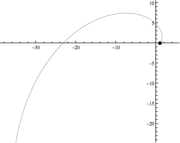
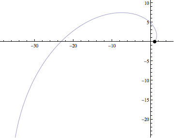

# Parametrizing with respect to arc length

 

The circle represents a particle moving along the curve at the speed of
the parametrization. The first curve is not parametrized with respect to
arc length, and the second curve is. Notice that the second particle is
moving at a constant speed. (Actually, the first curve is paramatrized
with respect to the the angle that the particle makes with the origin.)

[(Mathematica Notebook)](ArcLengthAnimation.nb)
