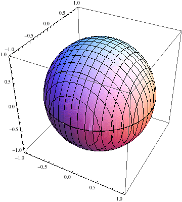

# Sphere = Cylinder - Cone

The Sphere has volume (4/3)&pi;r\^3, the Cylinder has volume &pi;r\^3, and
the cones have combined volume (2/3)&pi;r\^3. Here is an illustration of
how the sphere deforms into a cylinder, leaving a cone-shaped hole in
the middle. This animation was inspired by a talk that Dan Finkel once
gave.

[(Mathematica Notebook)](ConeSphereCylinder.nb)

[(Back to main page)](.)
