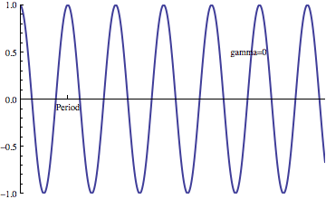

# The effect of damping

This animation shows what happens to the oscillation as damping
increases. Gamma denotes the damping coefficient, and gamma=1
corresponds to critical damping. Larger values of gamma are overdamped.
Notice that the quasi period increases as the damping increases. Of course, it
doesn't make sense to talk about the period once the system becomes
critically or overdamped.

