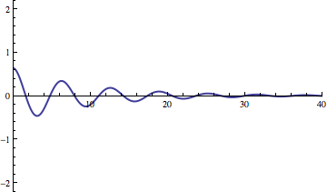

# Initial Velocity adds energy to the system

This animation shows what happens as you increase the initial velocity.
Basically, it adds energy to the system which slowly disipates because
the system is damped. Of course, changing the initial position (that is,
pulling back the spring) would have a similar effect.
