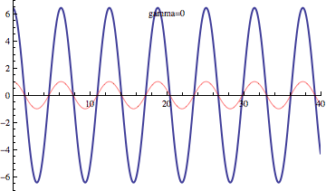

# Resonance and damping

This animation shows the effect of a forcing function on a slightly
damped oscillating system. The natural frequency of the oscillation is
about 1. Resonance happens as the forcing frequency gets close to the
natural frequency.
